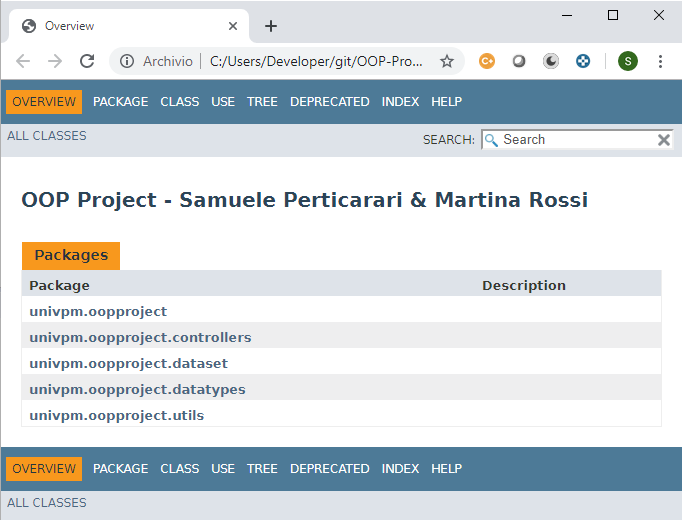

**NOTE**: *This file is outdated, please refer to [https://samupert.github.io/rest-api-eurostat-dataset/javadoc](https://samupert.github.io/rest-api-eurostat-dataset/javadoc)*

-----

# Progetto di Programmazione ad Oggetti
###### di Samuele Perticarari e Martina Rossi

L'applicazione presente nella repository è una REST API che permette di ottenere dei dati a partire da un dataset contenuto in un file TSV (Tab Separated Values), permettendo di filtrarli in maniera opportuna e di ottenere delle statistiche sui campi.

-----

## Formato dei metadati restituiti
In seguito ad una richiesta al servizio, riguardo i metadati, viene restituito come risultato un JSON rappresentante i metadati dei dati del dataset.

Il formato dell'oggetto rappresentante i metadati è il seguente:
```json
{
  "type": "object",
  "id": "urn:jsonschema:univpm:oopproject:datatypes:Person",
  "properties": {
    "wstatus": {
      "type": "string"
    },
    "indic_il": {
      "type": "string"
    },
    "sex": {
      "type": "string"
    },
    "etaMax": {
      "type": "integer"
    },
    "etaMin": {
      "type": "integer"
    },
    "etaRange": {
      "type": "string"
    },
    "country": {
      "type": "string"
    },
    "indexes": {
      "type": "array",
      "items": {
        "type": "object",
        "id": "urn:jsonschema:univpm:oopproject:datatypes:TupleData",
        "properties": {
          "year": {
            "type": "integer"
          },
          "value": {
            "type": "number"
          }
        }
      }
    }
  }
}
```

-----

## Formato dei dati restituiti
In seguito ad una richiesta al servizio viene restituito come risultato un JSON rappresentante un array di oggetti rappresentanti i dati appartenenti al dataset. Il formato dell'oggetto rappresentante il singolo elemento, nello specifico è il seguente:
```json
{
  "EtaRange": "16-64",
  "Wstatus": "EMP",
  "IndicIl": "LI_R_M40",
  "Sex": "F",
  "Country": "AT",
  "Dati": {
    "1995": 4,
    "1996": 3,
    "1997": 2,
    "1998": 3,
    "1999": 3,
    "2000": 2,
    "2001": 3,
    "2002": 0,
    "2003": 3.2,
    "2004": 3.2,
    "2005": 2.5,
    "2006": 2.3,
    "2007": 1.9,
    "2008": 3.1,
    "2009": 3,
    "2010": 3.2,
    "2011": 2.4,
    "2012": 3.4,
    "2013": 3.4,
    "2014": 2.7,
    "2015": 3,
    "2016": 2.4,
    "2017": 3.4,
    "2018": 2.6
  }
}
```

In particolare:

| Campo | Descrizione |
| - | - |
| **EtaRange** | Rappresenta il range di età del soggetto in questione. |
| **Wstatus** | Rappresenta lo stato lavorativo del soggetto. |
| **IndicIl** | Rappresenta un indice di una sottocategoria. |
| **Sex** | Rappresenta il sesso del soggetto. |
| **Country** | Rappresenta l'entità geopolitica di interesse. |
| **Dati** | Contiene l'array di indici suddivisi per anno. |

Le statistiche possono invece essere effettuate su una categoria specifica, specificando l'area geografica, il sesso, lo stato lavorativo, il range di età e/o l'indice della sottocategoria. Degli esempi di oggetti JSON restituiti per tutti i casi possono essere i seguenti:
```json
{
  "Dati": [
    {
      "TipoDato": "String",
      "Dati": [
        {
          "Conteggio": 1603,
          "Valore": "INAC_OTH"
        },
        ...
      ],
      "Attributo": "Wstatus"
    },
    {
      "TipoDato": "String",
      "Dati": [
        {
          "Conteggio": 609,
          "Valore": "LI_R_MD50"
        },
        ...
      ],
      "Attributo": "IndicIl"
    },
    ...
  ]
}
```

-----

## Routes dell'applicazione
Gli endpoint specificati nell'applicazione per effettuare le varie richieste sono le seguenti:

| Metodo | Endpoint | Descrizione |
| - | - | - |
| **GET** | **/** | Route che restituisce informazioni sui dati caricati dal dataset. |
| **GET** | **/get/metadata** | Route che restituisce i metadati in formato JSON. |
| **GET** | **/get/dataset/full** | Route che restituisce i dati del dataset in formato JSON. |
| **GET** | **/get/analytics** | Route che restituisce le analisi sui dati JSON. |
| **POST** | **/get/analytics** | Route che mostra i dati recuperati dal CSV, eventulmente filtrati, sotto forma di JSON. <br/> In particolare: <br/> **1. Corpo della richiesta non presente:** in questo caso verranno restituiti tutti i dati appartenenti al dataset, senza applicare alcun filtro. <br/> **2. Corpo della richiesta contenente il filtro:** in questo caso il dato verrà filtrato secondo secondo i filtri specificati. |

-----

## Filtri
Il filtro presente nel corpo della richiesta POST per filtrare i dati è una stringa in formato JSON, contenente degli oggetti dotati della seguente struttura:

```json
{
  "<campo_da_filtrare_1>": {
      "<operatore_1>": <dato_di_filtraggio_1>,

      ...

      "<operatore_n>": <dato_di_filtraggio_n>
	},

  ... ,

  "<campo_da_filtrare_n>": {
      "<operatore_1>": <dato_di_filtraggio_1>
  }
}
```

I campi su cui è possibile applicare i filtri sono quelli già citati in precedenza.

I filtri che possono essere applicati sono i seguenti:

| Tipo operatore | Operatore | Descrizione | Esempio |
| - | - | - | - |
| **Logico** | **$not** | Indica se il valore associato al campo è diverso da quello indicato nel filtro. | `{ "Wstatus": { "$not": "EMP" } }` |
| **Logico** | **$in** | Specificato un insieme di valori, indica se il valore associato al campo è uno di questi valori. | `{ "Wstatus": { "$in": [ "EMP", "EMPLOYER" ] } }` |
| **Logico** | **$nin** | Specificato un insieme di valori, indica se il valore associato al campo non è nessuno di questi valori. | `{ "Wstatus": { "$nin": [ "BOSS", "CEO" ] } }`  |
| **Logico** | **$or** | Specificato un insieme di filtri il dato è accettato se almeno uno dei filtri è soddisfatto. | `{ "$or": [ { "Wstatus": "EMP" }, {"Sex": "M" } ]` |
| **Logico** | **$and** | Specificato un insieme di filtri il dato è accettato se tutti i filtri sono soddisfatti. | `{ "$and": [ { "Wstatus": "BOSS" }, {"Sex": "F" } ]` |
| **Condizionale** | **$gt** | Indica se il valore associato al filtro è più grande rispetto a quello indicato nel campo. | `{ "2015": { "$gt": 10 } }` |
| **Condizionale** | **$gte** | Indica se il valore associato al filtro è uguale o più grande rispetto a quello indicato nel campo. | `{ "2014": { "$gte": 7.2 } }` |
| **Condizionale** | **$lt** | Indica se il valore associato al filtro è più piccolo rispetto a quello indicato nel campo. | `{ "2017": { "$lt": 4.1 } }` |
| **Condizionale** | **$lte** | Indica se il valore associato al filtro è uguale o più piccolo rispetto a quello indicato nel campo. | `{ "2013": { "$lte": 8.3 } }` |
| **Condizionale** | **$bt** | Specificati due valori numerici, indica se il valore associato al campo è compreso tra questi due valori. | `{ "2018": { "$bt": [ 2.9, 5.7 ] } }` |

----

# UML

## Diagramma delle classi

**Diagramma che consente di osservare come si relazionano le entità strutturali del sistema.**


----

## Diagramma dei casi d'uso

**Si tratta di un diagramma che esprime un comportamento offerto o desiderato e individua chi o che cosa ha a che fare con il sistema e che cosa viene fatto (Caso d'uso).**

**Nel nostro caso abbiamo un utilizzatore ("Attore" nel diagramma) associato ai seguenti casi d'uso:**

1. **Visualizzazione dei metadati del dataset.**
2. **Consultazione per intero dei dati del dataset.**
3. **Consultazione delle statistiche su ogni elemento del dataset.**
4. **Consultazione delle statistiche su elementi filtrati del dataset.**
5. **Applicazione dei filtri al dataset.**

**Nel caso n° 5, abbiamo un'<i>extention point</i> verso il caso d'uso n° 4.**

**In particolare specifica i punti e/o condizioni dell'esecuzione in cui il comportamento viene esteso. (POST con filtro presente e valido).**


----

## Diagramma delle sequenze
**E' un diagramma di comportamento che modella le interazioni tra varie entità di un sistema, visualizzando lo scambio di messaggi tra entità nel tempo.**

**Lo scopo del diagramma delle sequenze è quello di mostrare come un certo comportamento viene realizzato dalla collaborazione delle entità in gioco (Utente -> Web Server -> Web Server Remoto).**


----

## Documentazione
##### Reperibile aprendo il file `index.html` nella cartella `doc`.

